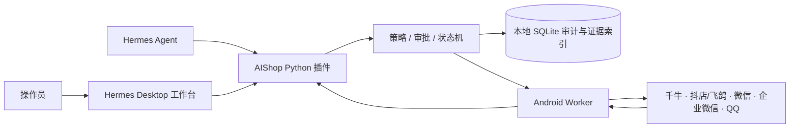

# AIShop Hermes 一体化工作台

[](LICENSE)
[](CHANGELOG.md)
[](https://github.com/atyunfeng/aishop-hermes-workbench/actions/workflows/ci.yml)

> **Alpha 状态：** 当前版本适合本地开发、确定性模拟和受控演示，尚未完成真实设备与平台账号验收，不应直接用于无人监管的生产客服或资金操作。

AIShop 是面向本地研发与受控演示的电商 AI 员工工作台。当前版本以独立 Hermes 统一插件和 Android Worker APK 交付，包含本地任务状态机、短租约设备调度、审批策略、SQLite 证据与审计、五个平台 App Skills、Hermes Desktop 原生“AI 员工作台”，以及真机配对、Accessibility 语义动作、按需画面和人工接管。

第一阶段覆盖千牛客服、抖店/飞鸽图片售后回复、微信私域服务、企业微信指挥多手机四条主演示，以及 QQ 基础接入。它同时提供真实手机模式和明确标注的确定性模拟模式；模拟结果不会伪装成真实平台操作。

English summary: AIShop is a local-first, experimental Hermes workbench for
safe e-commerce automation with versioned Android App Skills, approvals,
evidence and explicit human takeover.

## 当前能力与验证状态

| 能力 | 本地自动化测试 | 目标环境验证 |
| --- | --- | --- |
| 任务状态机、审批、审计、证据 | 已验证 | 不适用 |
| 千牛、抖店/飞鸽、微信、企业微信、QQ App Skill | Fixture 与 `SIMULATED` 流程已验证 | 真实账号与页面版本待验收 |
| Hermes Desktop 工作台 | TypeScript 构建与单元测试已验证 | Windows Hermes 运行时待验收 |
| Android Worker | JVM 测试、Lint 和 APK 构建已验证 | 物理设备、后台存活和厂商策略待验收 |
| 正式交付 | 对应源码与校验包可生成 | 正式签名 APK 待配置密钥后验收 |

## 架构



Hermes 只能调用声明的结构化工具；插件把任务编译为版本化语义步骤，Android Worker 执行并回传验证证据。任何验证码、登录失效、未知页面或超出审批范围的动作都会停止或转人工。

## 快速验证

如果只想检查仓库和模拟链路，不需要 Hermes、Windows 或手机：

```bash
python3.11 -m venv .venv
.venv/bin/python -m pip install -e '.[dev]'
npm ci
bash scripts/verify-foundation.sh
.venv/bin/python scripts/run-demo.py --flow all --mode simulated
```

输出证据会明确标记为 `SIMULATED`。

## 环境要求

- Windows 11（目标演示环境）
- Python 3.11 或更高版本
- Node.js 22.12 或更高版本
- 官方 Hermes Agent 与 Hermes Desktop
- Git、PowerShell 和 `rg`（开发验证使用）
- Android SDK 35、Java 21（构建手机员工使用）

## 开发环境

在仓库根目录执行：

```powershell
py -3.11 -m venv .venv
.\.venv\Scripts\python.exe -m pip install -e ".[dev]"
npm install
bash scripts/verify-foundation.sh
```

macOS/Linux 开发机可使用：

```bash
python3.11 -m venv .venv
.venv/bin/python -m pip install -e '.[dev]'
npm install
bash scripts/verify-foundation.sh
```

验证命令会运行 Python 测试、Ruff、Vitest、TypeScript 类型检查、Desktop Plugin 打包和运行时导入白名单检查。

构建并验证 Android Worker：

```bash
bash scripts/verify-android-worker.sh
```

成功后 demo APK 位于 `artifacts/aishop-worker-debug.apk`。验证同时编译
`productionRelease`，该变体强制 HTTPS；未提供签名环境变量时产物保持 unsigned，不能作为正式签名包交付。

执行第一阶段总验收并生成 Windows 发布包：

```bash
bash scripts/verify-phase1.sh
```

输出为 `artifacts/AIShop-Hermes-Workbench-phase1.zip`、APK 及对应 SHA-256 文件。Windows 也可直接运行 `scripts/package-release.ps1`。

## 安装到 Hermes

先完成构建和验证，然后在 Windows PowerShell 中执行：

```powershell
powershell -ExecutionPolicy Bypass -File .\scripts\install-dev.ps1
hermes plugins enable aishop
hermes desktop
```

如果 Hermes 使用自定义目录：

```powershell
.\scripts\install-dev.ps1 -HermesHome "D:\HermesHome"
```

安装器会将完整的 `hermes-plugin` 复制到 `$HERMES_HOME\plugins\aishop`，运行 Plugin Doctor，但不会自动启用插件或修改 Hermes 配置。已有插件目录会被改名保留为备份；`$HERMES_HOME\plugins-data\aishop` 中的 SQLite 数据不会被删除或覆盖。

启动 Hermes Desktop 后，在 **Settings → Plugins** 中启用 AIShop 桌面插件，再从侧栏打开“AI 员工作台”。Python 插件和桌面插件是两个独立的安全开关，首次安装都保持关闭，必须由操作员手动启用。

首次打开工作台还需输入本地操作员令牌。可显式设置：

```powershell
$env:AISHOP_OPERATOR_TOKEN = "使用密码管理器生成的随机长令牌"
```

未设置时，插件会生成权限受限的
`$HERMES_HOME\plugins-data\aishop\operator.token`。该令牌只用于桌面/Hermes 操作员接口；Android 使用独立设备令牌。不要把任一令牌写入 Skills、日志或发布包。

## Android Worker 真机配对

### 1. 准备局域网访问

Android 手机必须能访问 Hermes 插件 API。Hermes 进程如果只监听 `127.0.0.1`，需要按当前安装版本支持的方式改为监听 Windows 的局域网地址。只在 Windows Defender Firewall 的“专用网络”配置中放行实际 Hermes 端口，并把来源限制为演示局域网，不要直接暴露到互联网。

手机中填写的完整地址格式为：

```text
http://<Windows局域网IP>:<Hermes端口>/api/plugins/aishop
```

可以先在手机浏览器访问同一主机和端口，确认网络可达。当前 Android Worker 为可信局域网演示允许明文 HTTP；离开本地演示环境前必须改为 HTTPS，并重新评估设备凭据存储与证书校验。

### 2. 安装 APK

ADB 只用于开发安装和调试：

```bash
adb install -r artifacts/aishop-worker-debug.apk
```

正式演示中的配对、心跳和控制不依赖 ADB。

### 3. 完成配对

1. 在 Hermes Desktop 打开“AI 员工作台”。
2. 点击“生成配对码”，获得 5 分钟有效的 6 位数字。
3. 在手机打开 AIShop Worker，填写插件 API 地址、配对码和员工名称。
4. 点击“配对”，成功后手动启用“AIShop 手机员工”无障碍服务和“AIShop 消息监听”；需要画面时点击“授权画面”并确认 Android 系统 MediaProjection 弹窗。
5. 点击“启动”，并允许通知权限。
6. 设备应在 15 秒内显示在线；心跳正常时每 5 秒刷新一次。

配对码单次使用。手机收到的设备令牌经 Android Keystore AES-GCM 加密后保存在应用私有目录；电脑 SQLite 仅保存 SHA-256 摘要、到期和撤销状态。清除手机配对不会重置设备身份和心跳序号。

Android 通知入口只接受千牛、抖店/飞鸽、微信、企业微信和 QQ 的允许包。通知仅用于生成结构化入站事件；真正回复仍必须打开 App、匹配版本化语义节点并验证结果。开机恢复默认关闭，只有已配对且用户显式开启时才启动。

### 4. 控制验收

在设备卡片依次验证：

- “暂停”后手机状态变为 `PAUSED`。
- “继续”后回到 `IDLE`。
- “接管”必须二次确认，状态变为 `TAKEOVER`。
- “停止”必须二次确认，手机确认命令后结束前台服务。
- 断开手机网络 15 秒后，设备卡片变为离线；恢复网络并重新启动服务后重新上线。

控制命令只有 `PAUSE`、`RESUME`、`TAKEOVER` 和 `STOP`，在手机确认前会重复投递。业务执行协议只接受版本化 App Skill 编译出的 `LAUNCH_APP`、`TAP_NODE`、`SET_TEXT`、`SCROLL`、`BACK`、`WAIT_FOR`、`VERIFY_NODE` 和 `CAPTURE_SCREEN`；不接受坐标、Shell、脚本或任意动作。

## 四条主演示

在桌面工作台的“主演示流程”中选择“确定性模拟”或“真实手机”，分别运行千牛、抖店/飞鸽、微信和企业微信流程。命令行确定性回归：

```powershell
.\.venv\Scripts\python.exe .\scripts\run-demo.py --flow all --mode simulated
```

正常流程稳定经过：

```text
RECEIVED → PLANNING → QUEUED → ASSIGNED → EXECUTING → VERIFYING → SUCCEEDED
```

执行时间线展示租约、语义步骤、关键证据、最终回执与异常。详细演示步骤见 `docs/demo-runbook.md`。

## 安全边界

- Hermes 只能调用声明的结构化 AIShop 工具和 App Skill 工作流，不能下发任意坐标、Shell 命令或可执行代码。
- 每个任务和状态变更都有幂等键、版本号和本地审计事件。
- `EXECUTING` 不能跳过 `VERIFYING` 直接成功。
- 全局急停必须由操作员在工作台二次确认。
- 资金、退款/退货执行、账号、删除、加好友和群发必须使用一次性限定范围审批；主演示不会自动批准这些动作，抖店退货工作流只会在精确范围获批后恢复一次。
- Android Worker 只在操作员手动启用 Accessibility 后读取语义节点；验证码、登录失效和未知页面会停止并转人工。
- MediaProjection 必须经过 Android 系统逐次授权，停止服务或清除配对会立即结束画面采集。
- 证据限制为 PNG/JPEG/文本且最大 700 KiB；真实手机标记 `DEVICE`，确定性演示标记 `SIMULATED`。
- 操作员接口要求 `X-AIShop-Operator-Token`；设备接口要求独立 bearer token。证据读取通过认证后的 JSON 数据接口完成，不在图片 URL 中泄露令牌。
- 证据默认保留 7 天并限制为 512 MiB；可运行维护和脱敏导出：

```powershell
.\.venv\Scripts\python.exe .\scripts\export-local-data.py --output .\artifacts\aishop-metadata.json
```

导出不包含令牌、消息原始 payload、知识正文或证据文件内容。

## 回滚

先禁用插件，再把安装目录改名保留：

```powershell
hermes plugins disable aishop
Rename-Item "$env:LOCALAPPDATA\hermes\plugins\aishop" "aishop.disabled"
```

不要删除 `$env:LOCALAPPDATA\hermes\plugins-data\aishop`；其中包含任务和审计数据。需要恢复时，将插件目录改回 `aishop`，重新运行 `hermes plugins doctor <插件目录> --ci`，然后手动启用。

## 隐私、安全与贡献

- 数据类型、保留和删除方式见 [PRIVACY.md](PRIVACY.md)。
- 漏洞请按 [SECURITY.md](SECURITY.md) 私下报告，不要在 Issue 中发布利用细节或真实客户数据。
- 开发规范和 DCO 签署要求见 [CONTRIBUTING.md](CONTRIBUTING.md)。
- 真实设备验收清单见 [docs/real-device-validation.md](docs/real-device-validation.md)。

## 许可证与源码

AIShop Hermes Workbench 采用 [GNU Affero General Public License v3.0 only](LICENSE)，SPDX 标识为 `AGPL-3.0-only`。软件按“原样”提供且不附带担保。第三方组件归属见 [THIRD_PARTY_NOTICES.md](THIRD_PARTY_NOTICES.md)。

完整对应源码：<https://github.com/atyunfeng/aishop-hermes-workbench>
